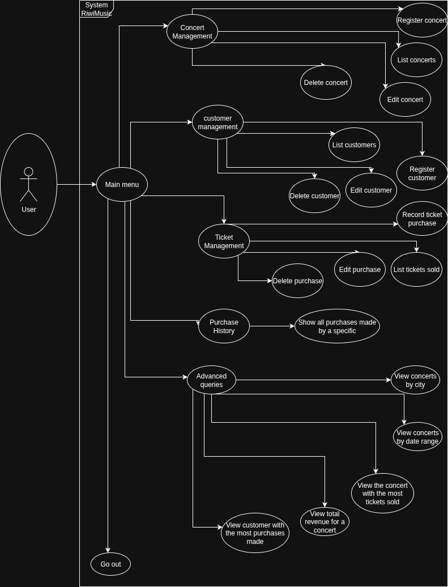
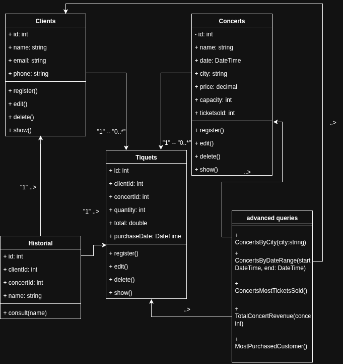

# RiwiMusic - Concert and Ticket Management System

## Project Description

RiwiMusic is a console application developed in C# with .NET 8.0 that provides a complete management system for concerts, clients, and ticket sales. The application allows managing musical events, maintaining a client database, and processing ticket sales transactions with advanced query and reporting functionalities.

## System Architecture

### Use Case Diagram



### UML Class Diagram



## Project Structure

```
Sprint-02-Voyager/
├── Models/
│   ├── Clients.cs          # Data model for clients
│   ├── Concerts.cs         # Data model for concerts
│   └── Tickets.cs          # Data model for tickets
├── Services/
│   ├── ClientsService.cs   # Business logic for clients
│   ├── ConcertsService.cs  # Business logic for concerts
│   ├── TicketsService.cs   # Business logic for tickets
│   ├── PurchaseHistory.cs  # Purchase history management
│   └── ConsultsAdvances.cs # Advanced queries and reports
├── Program.cs              # Application entry point
└── Sprint-02-Voyager.csproj # Project configuration file
```

## Main Features

### Concert Management
- **Concert Registration**: Creation of new events with future date validation
- **Concert Listing**: Display of all registered concerts
- **Concert Editing**: Modification of existing concert data
- **Concert Deletion**: Removal of concerts from the system

### Client Management
- **Client Registration**: Creation of client profiles with email validation
- **Client Listing**: Display of the client database
- **Client Editing**: Update of client information
- **Client Deletion**: Removal of clients from the system

### Ticket Management
- **Purchase Registration**: Sales processing with capacity validation
- **Purchase Listing**: Display of all transactions
- **Inventory Validation**: Verification of ticket availability

### Purchase History
- **Client Query**: Display of purchase history for a specific client
- **Detailed Reports**: Complete information of performed transactions

### Advanced Queries
- **City Filtering**: Search concerts by location
- **Date Range Filtering**: Query concerts within specific time ranges
- **Sales Analysis**: Identification of the concert with the highest number of tickets sold
- **Revenue Calculation**: Total revenue generated by specific concert
- **Client Analysis**: Identification of the client with the highest number of purchases

## Technical Features

### Implemented Validations
- **Email Validation**: Correct format verification using regular expressions
- **Date Validation**: Ensures concerts have future dates
- **Capacity Validation**: Prevents selling more tickets than available
- **Existence Validation**: Verifies existence of clients and concerts before processing sales

### Error Handling
- **Comprehensive Try-Catch**: Exception capture and handling in all operations
- **Input Validation**: Verification of data types and valid ranges
- **Descriptive Messages**: Clear feedback to users about errors and successful operations

### Naming Consistency
- **English Standardization**: Consistent use of English terminology
- **Descriptive Names**: Identifiers that clearly reflect their purpose
- **C# Conventions**: Following language best practices

## System Requirements

### Minimum Requirements
- .NET 8.0 Runtime
- .NET 8.0 compatible operating system
- Terminal or console for execution

### Dependencies
- Microsoft.NET.Sdk
- System.Text.RegularExpressions (for email validation)

## Installation and Execution

### Prerequisites
1. Install .NET 8.0 SDK from [dotnet.microsoft.com](https://dotnet.microsoft.com/download)
2. Verify installation by running `dotnet --version`

### Installation Steps
1. Clone or download the project repository
2. Navigate to the project directory: `cd Sprint-02-Voyager`
3. Restore dependencies: `dotnet restore`
4. Build the project: `dotnet build`
5. Run the application: `dotnet run`

### Development Commands
```bash
# Build the project
dotnet build

# Run the application
dotnet run

# Clean build files
dotnet clean

# Restore NuGet packages
dotnet restore
```

## Application Usage

### Main Menu
When running the application, a menu is presented with the following options:

1. **Concert Management** - Complete event administration
2. **Client Management** - Client database administration
3. **Ticket Management** - Sales processing and queries
4. **Purchase History** - Transaction queries by client
5. **Advanced Queries** - System reports and analysis
6. **Exit** - Terminate the application

### Typical Workflow
1. Register concerts with their respective details
2. Register clients in the system
3. Process ticket sales validating availability
4. Query histories and generate reports as needed

## Design Considerations

### Architecture Pattern
The application implements a layered architecture with clear separation of responsibilities:
- **Models Layer**: Data entities with properties and basic validations
- **Services Layer**: Business logic and CRUD operations
- **Presentation Layer**: Console interface and user flow

### Data Management
- **In-Memory Storage**: Data is maintained during the execution session
- **Unique Identifiers**: Auto-increment system for IDs
- **Referential Integrity**: Validation of relationships between entities

### Scalability
The current design allows for future extensions such as:
- Integration with persistent database
- Graphical interface implementation
- Authentication functionality addition
- REST API implementation

## Current Limitations

- **Data Persistence**: Data is lost when closing the application
- **Concurrency**: Does not support multiple simultaneous users
- **Interface**: Limited to text console
- **Validations**: Some validations could be more robust

## Contributing

To contribute to the project:
1. Fork the repository
2. Create a branch for the new functionality
3. Implement changes following established conventions
4. Test modifications thoroughly
5. Submit pull request with detailed description


